# Proyecto de Revisión de Código


## Tecnologías

* Lenguaje de programación: **PHP 8.1**
* Framework: **Laravel 10**
* Base de datos: **MySQL**
* Integraciones:
    * **Gemini API** [google-gemini-php/laravel](https://github.com/google-gemini-php/laravel)
    * **OpenAI API** [openai-php/laravel](https://github.com/openai-php/laravel)


## Base de datos

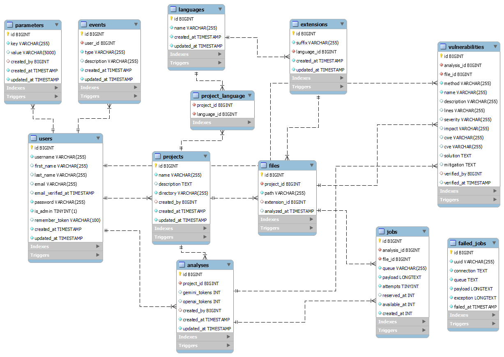

Para vaciar la base de datos y ejecutar todas las migraciones nuevamente, usar el siguiente comando:

```
php artisan migrate:fresh --seed
```

Después de ejecutar las migraciones, se insertarán en la base de datos los valores predefinidos en la clase `DatabaseSeeder`, ubicada en la carpeta `database/seeders`.


## Configuración General

Antes de subir y analizar proyectos, asegurar la configuración de los parámetros como `GEMINI_API_KEY`, `OPENAI_API_KEY`, `OPENAI_ORGANIZATION`, entre otros, para el uso de las APIs de inteligencia artificial.

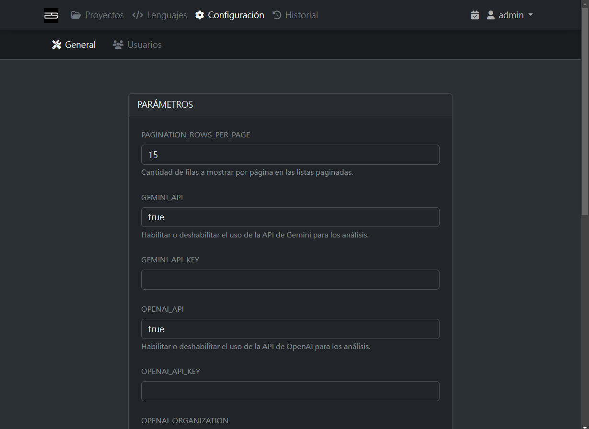


## Configuración de Usuarios

Solo los usuarios con rol de administrador pueden crear nuevos usuarios, asignar roles de administrador o pentester, y eliminarlos.

Para crear un nuevo usuario, utilizar el formulario y copiar la contraseña generada para entregársela al usuario.

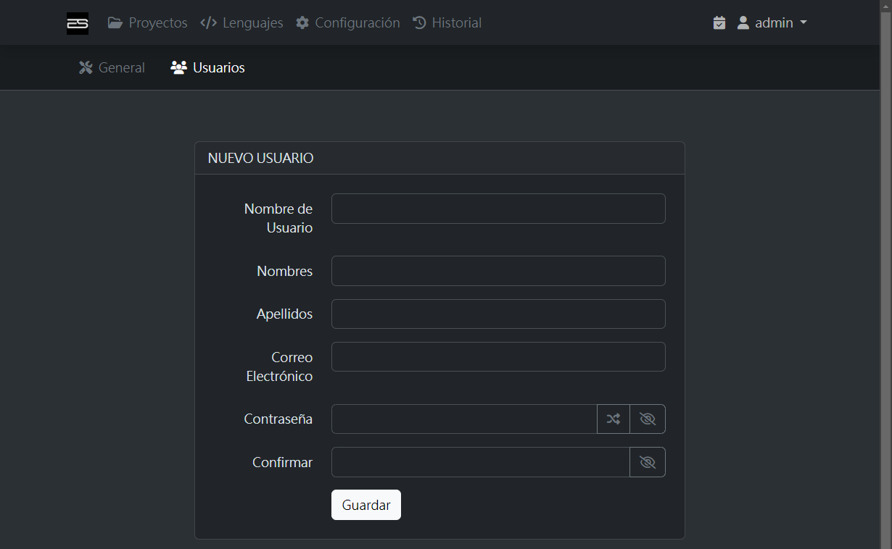

Por defecto, un nuevo usuario se crea con el rol de `Pentester`. El rol puede ser cambiado haciendo clic en los botones `Pentester` o `Administrador`.

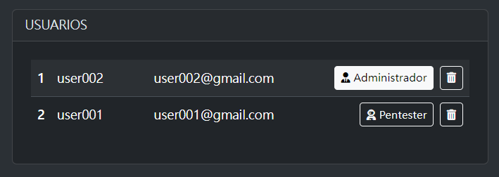

Cuando el usuario inicie sesión con su cuenta, podrá cambiar su contraseña en la sección `Mi Perfil`.

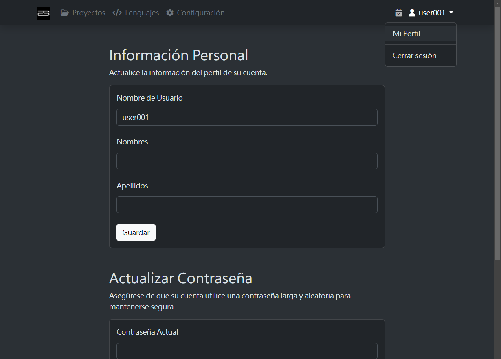


## Gestión de Proyectos

Para subir un proyecto con extensión `.zip`, asegurar de que el tamaño del archivo sea menor a 256MB.

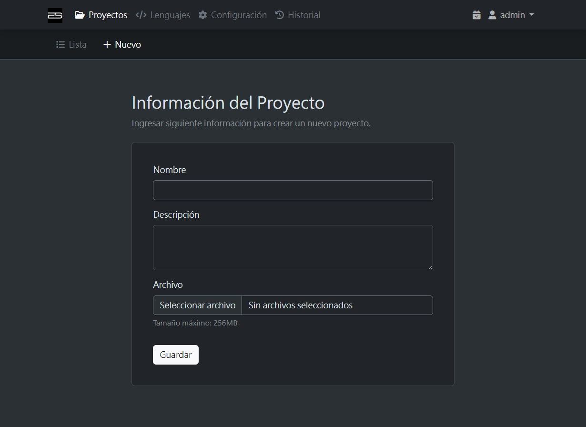

El proyecto subido es almacenado y descomprimido en la carpeta `storage/app/projects`. Una vez finalizada la subida, los archivos se descomprimen automáticamente filtrando las extensiones registradas.

La opción para eliminar el proyecto se encuentra al final de la página del listado de archivos. Esta operación está permitida solo para el usuario administrador o el usuario que subió el proyecto.

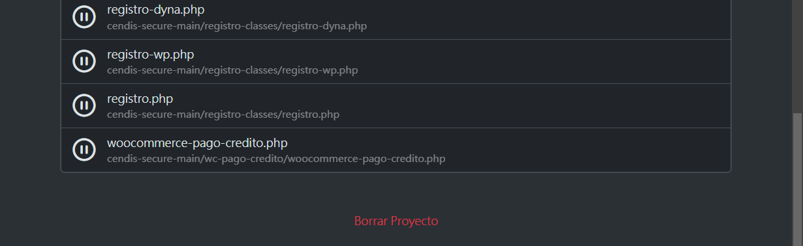


## Análisis de Código

Para analizar un proyecto, seleccionar el proyecto que se desea analizar y accede a la página de análisis.

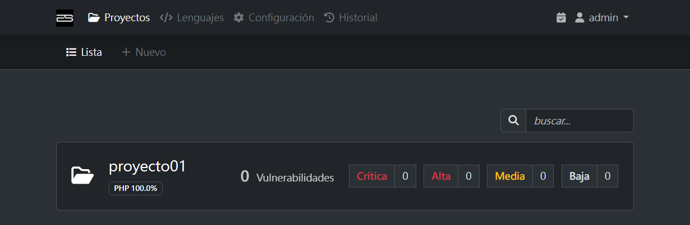

Iniciar el análisis con el botón `Analizar`. Si no están configuradas las API keys, la página se redirigirá a `Configuración General`.

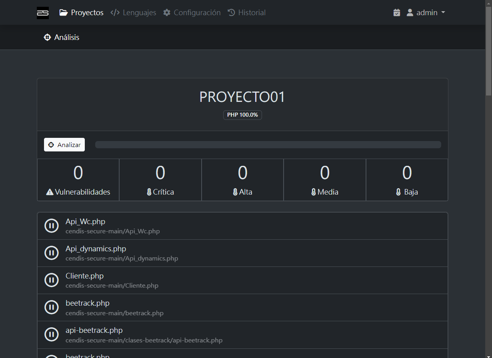

Una vez iniciado el análisis, las tareas se crean y ejecutan en segundo plano, y la página se actualiza automáticamente con los resultados obtenidos.

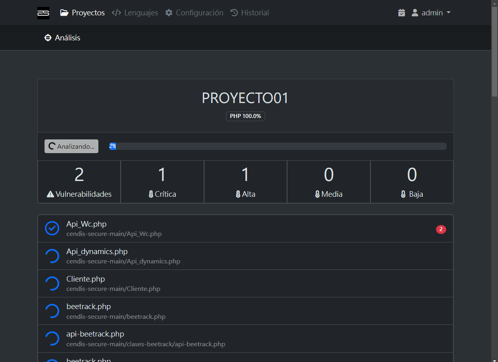

En el panel lateral se puede visualizar en tiempo real el progreso de las tareas del segundo plano.

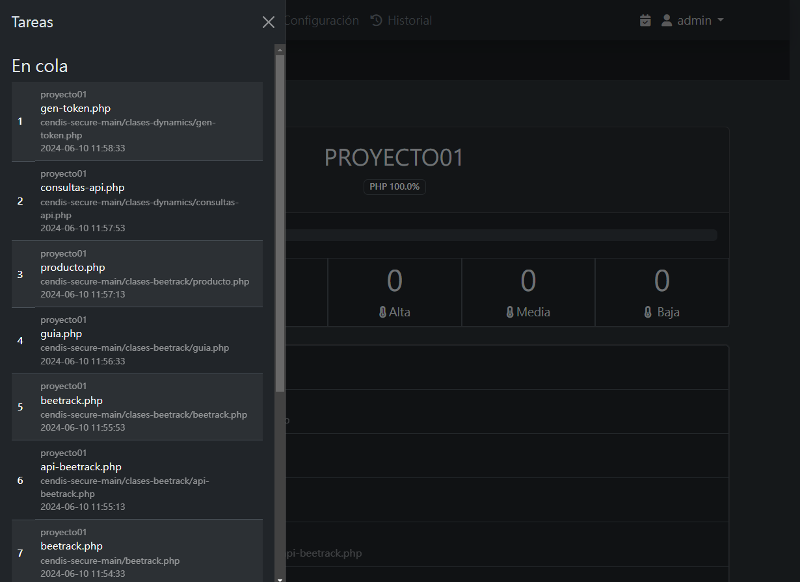

Después de iniciar el análisis, la página de `Vulnerabilidades` muestra la lista de vulnerabilidades detectadas, separadas por Gemini API y OpenAI API. Y se puede confirmar las vulnerabilidades como verdaderos positivos marcando la casilla correspondiente. Al exportar a Excel, solo se exportarán las vulnerabilidades confirmadas.

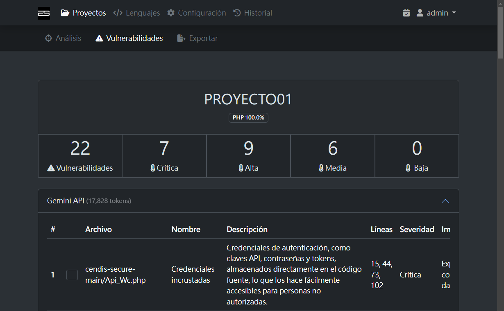

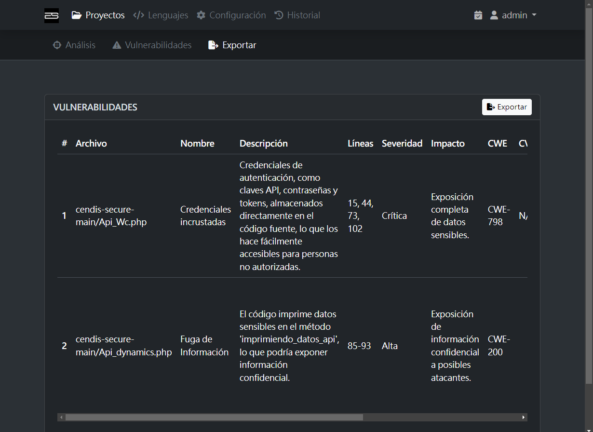

